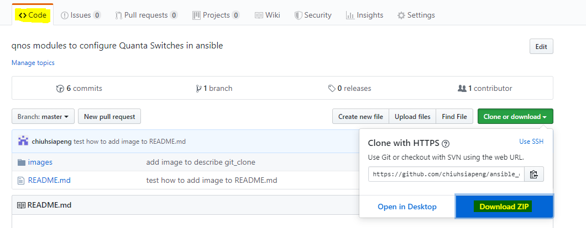

# Experimental QNOS Ansible Modules
This repository keeps the QNOS Ansible modules.
After QNOS Ansible modules are upstreamed to Ansible, QNOS modules will be installed at the same time when you install Ansible, since they are part of Ansible’s release.
Because some QNOS modules are under development, you still can use this way to update the QNOS Ansible modules.

#	The purpose of QNOS modules
Ansible is a popular tool to help you automate I.T. process e.g. provision IT resources, deploy application and network configurations.

## QNOS `network_cli` platform
The `qnos` `cliconf` plugin provides the capabilities to use Ansible vendor agnostic modules (`cli_command` and `cli_config`) to automate against QUANTA Switches. Please refer to [Advanced Topics with Ansible for Network Automation](https://docs.ansible.com/ansible/latest/network/user_guide/index.html) for more detailed information.

Remember set `ansible_network_os` and `ansible_connection` correctly, i.e.:

```
ansible_network_os=qnos
ansible_connection=network_cli
```

The following is an example task which uses `cli_command` module:
```
- name: get output for single command
  cli_command:
    command: show version
  register: result
```

The following is an example task which uses `cli_config` module:
```
- name: setup
  cli_config:
    config: |
      interface loopback 0
      no description
      shutdown
    diff_match: none
```


## Extended QNOS modules
QNOS Ansible modules provide additional functionality to help managing/configuring QUANTA Switches.

The following is an example task which uses `qnos_system` module to add `ansible.com` and `redhat.com` to the `ip domain-list`.
```
- name: configure domain_search
  qnos_system:
    domain_search:
      - ansible.com
      - redhat.com
  register: result
```

# How to add QNOS Ansible modules locally
## Install in a relative location
Ansible allows you to put modules in a location that is relative to the project you are working on. To accomplish this, follow the instructions below.

### Correctly setup the path for custom modules and plugins
Please refer to [Adding modules and plugins locally](https://docs.ansible.com/ansible/latest/dev_guide/developing_locally.html) to correctly setup the path for QNOS modules and plugins.

You need store the downloaded files to the corresponding directories, for example, to use a local module only in certain playbooks: you can copy the files in `library` to a sub-directory called `library` in the directory that contains the playbook(s).
You can still set the following variables to instruct Ansible to look for additionally directories to look for modules, module utils, and different kinds of plugins.
```
library
module_utils
action_plugins
terminal_plugins
```

### Add qnos to the variable `network_group_modules`
An example of `network_group_modules`:
```diff
- network_group_modules = eos, nxos, ios, iosxr, junos, vyos
+ network_group_modules = eos, nxos, ios, iosxr, junos, vyos, qnos
```

### Get the source
Next, you must get the contents of the qnos_ansible_modules. This can be done in either of two ways.

**Via a git clone (recommended)**

In addition to get the source code of QNOS Ansible modules, you can easily update the source code by issuing the following command:
```
git clone https://github.com/chiuhsiapeng/ansible_qnos_modules
```
**Via downloading a zip file**

Another method is to download a ZIP file of the contents of the respository. To use this method, you should navigate to the __Code__ tab, as shown below in the corresponding Github repository. Once on this page, click the green __Clone or download__ button. Download this zip file and extract it.


### Moving the downloaded code
As it is mentioned in the previous section [Correctly setup the path for custom modules and plugins](#Correctly-setup-the-path-for-custom-modules-and-plugins), please move the downloaded code to the corresponding directories.
